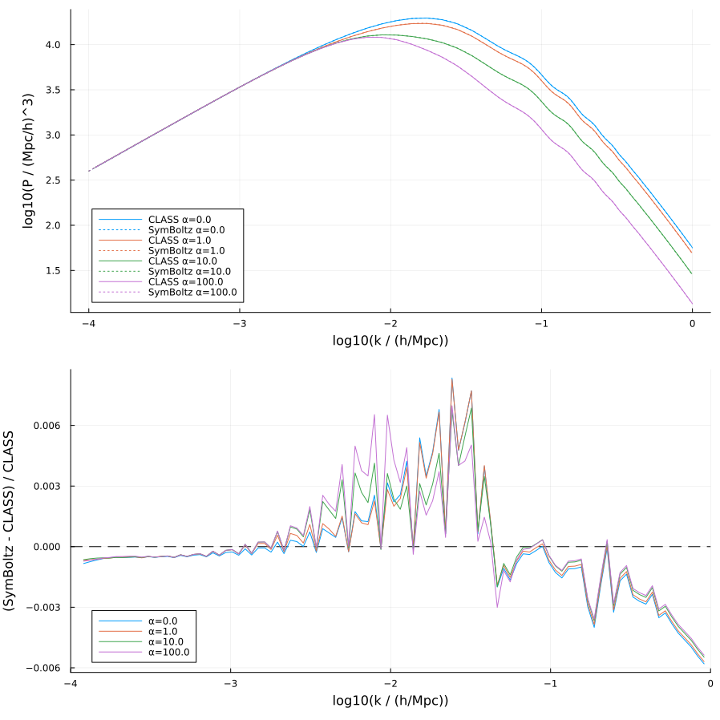
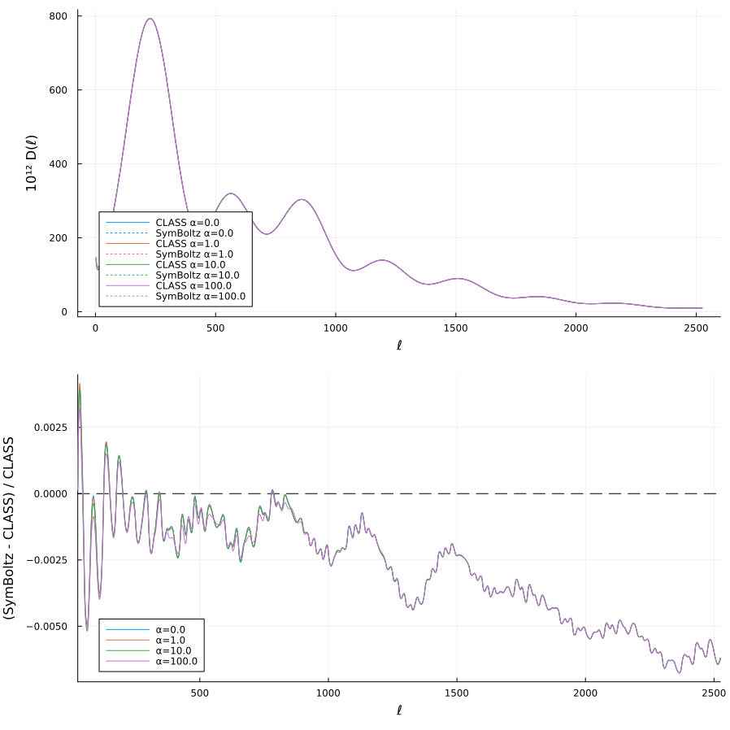

# SymBoltz Implementation of Pure Momentum Transfer in the Dark Sector

Author: **David Figueruelo**

This repository contains an **implementation in SymBoltz** of a **momentum transfer interaction between Dark Energy (DE) and Dark Matter (DM)** at the level of cosmological perturbations.

The model implemented in this code corresponds to the same physical model implemented in the modified CLASS code available at:

https://github.com/david-figuer/CLASS_momentum_transfer

The goal of this repository is to reproduce the same cosmological predictions using **SymBoltz** while preserving the physical implementation used in the CLASS version.

The SymBoltz implementation has been **explicitly validated against the CLASS implementation**, showing **sub-percent level agreement** in both the matter power spectrum and the CMB angular power spectra.

The physical model implemented in this repository is based on peer-reviewed publications and a doctoral thesis developed by the author of this repository (**David Figueruelo**) in collaboration with Jose Beltrán Jiménez, Dario Bettoni, and Florencia A. Teppa Pannia.


The implementation is based on the same physical momentum-transfer framework developed in the literature cited below, extended here to a unified SymBoltz implementation of the full **pure momentum** model.

**Any scientific use of this code requires citation of the first reference listed in the Citations section below.**

---

# Running the Code

Run Julia with multithreading enabled:

```
julia -tauto
```

Then execute

```
include("pure_momentum_symboltz.jl")
```


# Related Codes

The same DE–DM momentum transfer model has been implemented in other Boltzmann solvers.

**CLASS implementation**

https://github.com/david-figuer/CLASS_momentum_transfer

**CAMB implementation**

https://github.com/fateppapannia/CAMB_DMDE_momentum_transfer

---

# Origin, Attribution, and Relation to SymBoltz

This repository uses the **SymBoltz Boltzmann solver**, developed by:

**Herman Sletmoen**

Original SymBoltz repository:  
https://github.com/hersle/SymBoltz.jl

This repository is **NOT an official fork of SymBoltz**. It is an **independent repository implementing a cosmological model using the SymBoltz framework**.

Users must comply with the **citation requirements of the original SymBoltz code** when using this implementation in scientific work.

---

# Structure of the Repository

The repository contains two main Julia scripts.

### model_momentum_pk.jl

Computes the **matter power spectrum P(k)** using SymBoltz for different values of the coupling parameter α.

### model_momentum_CMB.jl

Computes the **CMB angular power spectra**

- TT
- TE
- EE

Both scripts implement the αCDM model with momentum transfer between Dark Energy and Dark Matter.

The code is designed so that the user can easily run:

- a single cosmology
- several coupling configurations
- one or several observables in a single execution

---

# Physical Model

This code implements an **elastic scattering (momentum transfer) interaction between Dark Energy and Dark Matter**, modifying the **velocity (θ) equations** of DE and DM at the level of **linear cosmological perturbations**.

The interaction modifies the perturbation equations through terms of the form

Γα (θ_DE − θ_DM)

in the Dark Matter velocity equation, and a corresponding term in the Dark Energy velocity equation

Γα Rα (θ_DE − θ_DM)

where the coupling rate Γα is proportional to the parameter **α**.

---

# Model Parameter

The interaction strength is controlled by the coupling parameter

```
α
```

which determines the magnitude of the momentum transfer between Dark Energy and Dark Matter.


---

# Model Parameters

The interaction strength is controlled by the coupling parameter


α


where:

- **α** controls momentum transfer between **Dark Energy and Dark Matter**


---

# Validation Against CLASS

The SymBoltz implementation has been directly compared with the CLASS implementation of the same model.

The resulting cosmological observables agree at the **sub-percent level**, confirming the correctness of the symbolic implementation.

### Matter Power Spectrum Comparison



---

### CMB TT Comparison



---

# Requirements

Julia ≥ 1.9

Required packages:

- SymBoltz
- Plots
- Unitful
- UnitfulAstro

Example installation:

```
using Pkg
Pkg.add("SymBoltz")
Pkg.add("Plots")
Pkg.add("Unitful")
Pkg.add("UnitfulAstro")
```

---

# Running the Code

Run Julia with multithreading enabled

```
julia -tauto
```

Then execute

```
include("model_momentum_pk.jl")
include("model_momentum_CMB.jl")
```

---

# Citations

If you use this code in scientific work, please cite at least the following references:

### Momentum transfer model

```
@article{Figueruelo:2021elm,
  author = "Figueruelo, David and others",
  title = "{J-PAS: Forecasts for dark matter - dark energy elastic couplings}",
  eprint = "2103.01571",
  archivePrefix = "arXiv",
  primaryClass = "astro-ph.CO",
  doi = "10.1088/1475-7516/2021/07/022",
  journal = "JCAP",
  volume = "07",
  pages = "022",
  year = "2021"
}
```

### SymBoltz

```
@article{SymBoltz,
  title = {{SymBoltz.jl}: a symbolic-numeric, approximation-free and differentiable linear {Einstein-Boltzmann} solver},
  author = {Herman Sletmoen},
  year = {2025},
  journal = {arXiv},
  eprint = {2509.24740},
  archiveprefix = {arXiv},
  primaryclass = {astro-ph.CO},
  doi = {10.48550/arXiv.2509.24740},
  url = {http://arxiv.org/abs/2509.24740}
}
```

---

# Contact

**David Figueruelo**  
david.figueruelo@ehu.eus

Universidad del País Vasco / Euskal Herriko Unibertsitatea (UPV/EHU)  
Investigador especialización doctores (2024)
