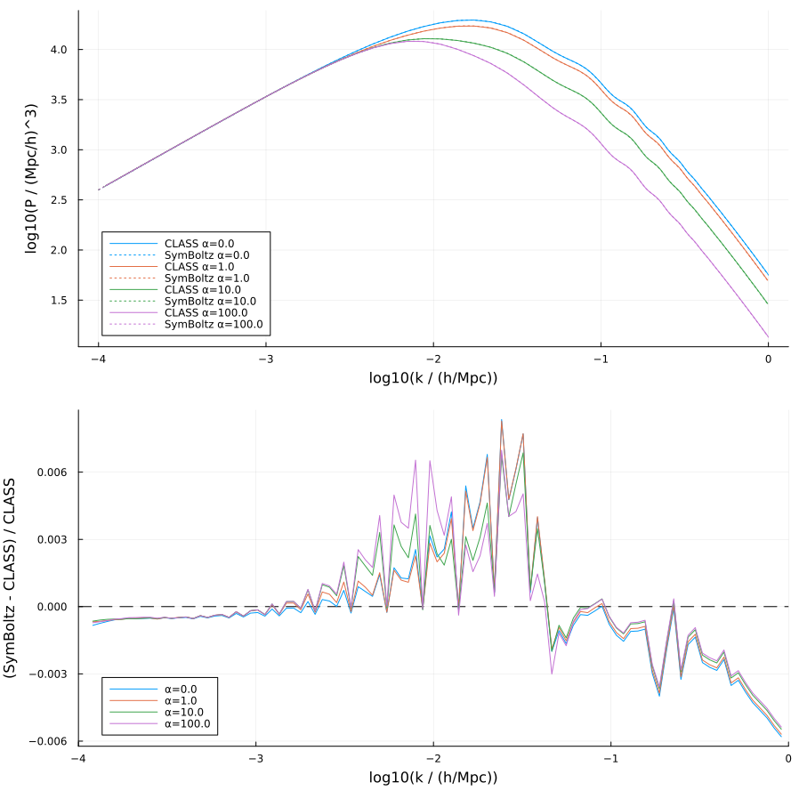

# SymBoltz Implementation of Pure Momentum Transfer involving the Dark Sector

Author: **David Figueruelo**

This repository contains an **implementation in SymBoltz** of a **pure momentum transfer cosmological model** at the level of linear cosmological perturbations.

The code includes three possible momentum-transfer interaction channels:

- **Dark Energy – Dark Matter** with coupling parameter $\alpha$
- **Dark Energy – Baryons** with coupling parameter $\beta$
- **Dark Matter – Baryons** with coupling parameter $\gamma$

All three interactions are implemented within a single symbolic SymBoltz model.

The goal of this repository is to provide a flexible and transparent **SymBoltz implementation** of these interacting cosmologies, suitable for computing both:

- the **matter power spectrum** $P(k)$
- the **CMB angular power spectra** (for example **TT**, **EE**, and **TE**)

The implementation is based on the same physical momentum-transfer framework developed in the literature cited below, extended here to a unified SymBoltz implementation of the full **pure momentum** model.

---

## Running the Code

Run Julia with multithreading enabled:

```bash
julia -tauto
```

Inside Julia, execute:

```julia
include("pure_momentum_symboltz.jl")
```

> **Note:** Only change the **USER CONFIG** section of the `.jl` file. There you can choose the values of the coupling parameters for each pure momentum transfer, the values of the other cosmological parameters, and where to place the output.

In particular:
- `coupling_sets` $\rightarrow$ choose the value of $\alpha$, $\beta$, and $\gamma$
- `run_mode` $\rightarrow$ choose if you want the matter power spectrum (`:pk`), the CMB (`:cmb`), or both (`:both`)
- `cmb_modes` $\rightarrow$ choose which CMB spectra you want (`:TT`, `:EE`, `:TE`)
- `Cosmology params` $\rightarrow$ choose the value of the common cosmological parameters
- `P(k) grid and CMB grid` $\rightarrow$ choose $k$ and $\ell$ grids for `:pk` and/or `:cmb`

*Other sections of the code deal with the cosmology. Change at your own risk.*

---

## Code Overview

The main Julia scripts allow the computation of observables depending on the configuration:

- **Matter power spectrum** $P(k)$
- **CMB angular power spectra** (**TT**, **EE**, **TE**)

Depending on the script configuration, the user can easily run:
- A single cosmology
- Several coupling configurations
- One or several observables in a single execution

---

## Physics / Model Details

### Dark Matter – Baryons

This code implements an **elastic scattering (momentum transfer) interaction between Dark Matter and Baryons**, modifying the **velocity ($\\theta$) equations** of DM and Baryons at the level of **linear cosmological perturbations**.

The interaction modifies the perturbation equations through terms of the form:

$$\Gamma_\gamma (\theta_\mathrm{B} - \theta_\mathrm{DM})$$

in the Baryons velocity equation, and a corresponding term:

$$\Gamma_\gamma R_\gamma (\theta_\mathrm{B} - \theta_\mathrm{DM})$$

in the Dark Matter velocity equation, where the coupling rate $\Gamma_\gamma$ is proportional to the parameter **$\gamma$**.

---

## Model Parameters

The interaction strengths are controlled by the coupling parameters $\alpha$, $\beta$, and $\gamma$:

- **$\alpha$** controls momentum transfer between **Dark Energy and Dark Matter**
- **$\beta$** controls momentum transfer between **Dark Energy and Baryons**
- **$\gamma$** controls momentum transfer between **Dark Matter and Baryons**

These parameters can be set independently.

---

## Validation Against CLASS

The SymBoltz implementation has been directly compared with the CLASS implementation of the same model.

The resulting cosmological observables agree at the **sub-percent level**, confirming the correctness of the symbolic implementation.



---

## Observables

The repository can compute the following cosmological observables with SymBoltz:

### Matter Power Spectrum
- **$P(k)$**

### CMB Angular Power Spectra
- **TT**
- **EE**
- **TE**

The user can choose which observable(s) to compute directly from the Julia script configuration.

---

## Requirements

- **Julia** $\ge$ 1.9

### Required Packages
- `SymBoltz`
- `Plots`
- `Unitful`
- `UnitfulAstro`

**Example installation:**

```julia
using Pkg
Pkg.add("SymBoltz")
Pkg.add("Plots")
Pkg.add("Unitful")
Pkg.add("UnitfulAstro")
```

---

## Citations

If you use this code in scientific work, please cite at least the following references:

### Momentum transfer model DE-DM
```bibtex
@article{Figueruelo:2021elm,
  author        = "Figueruelo, David and others",
  title         = "{J-PAS: Forecasts for dark matter - dark energy elastic couplings}",
  eprint        = "2103.01571",
  archivePrefix = "arXiv",
  primaryClass  = "astro-ph.CO",
  doi           = "10.1088/1475-7516/2021/07/022",
  journal       = "JCAP",
  volume        = "07",
  pages         = "022",
  year          = "2021"
}
```

### Momentum transfer model DE-B
```bibtex
@article{BeltranJimenez:2020iyx,
  author        = "Beltr{\'a}n Jim{\'e}nez, Jose and Bettoni, Dario and Figueruelo, David and Teppa Pannia, Florencia A.",
  title         = "{On cosmological signatures of baryons-dark energy elastic couplings}",
  eprint        = "2004.14661",
  archivePrefix = "arXiv",
  primaryClass  = "astro-ph.CO",
  doi           = "10.1088/1475-7516/2020/08/020",
  journal       = "JCAP",
  volume        = "08",
  pages         = "020",
  year          = "2020"
}
```

### Momentum transfer model DM-B
*(To be announced)*

### SymBoltz
```bibtex
@article{SymBoltz,
  title         = {{SymBoltz.jl}: a symbolic-numeric, approximation-free and differentiable linear {Einstein-Boltzmann} solver},
  author        = {Herman Sletmoen},
  year          = {2025},
  journal       = {arXiv},
  eprint        = {2509.24740},
  archiveprefix = {arXiv},
  primaryclass  = {astro-ph.CO},
  doi           = {10.48550/arXiv.2509.24740},
  url           = {http://arxiv.org/abs/2509.24740}
}
```

---

## Contact

**David Figueruelo**  
`david.figueruelo@ehu.eus`  
Universidad del País Vasco / Euskal Herriko Unibertsitatea (UPV/EHU)  
*Investigador especialización doctores (2024)*
